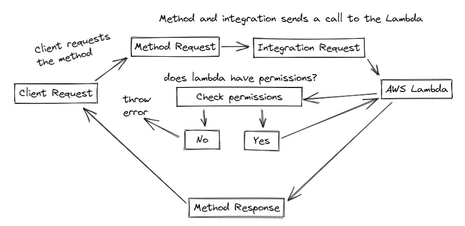
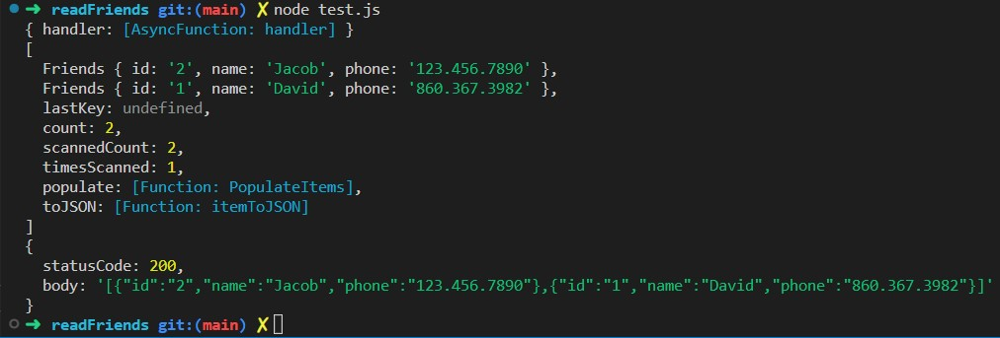
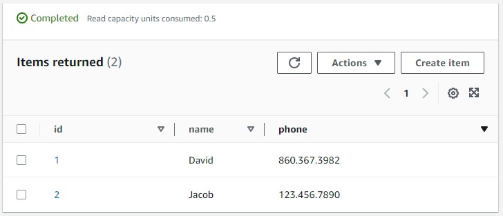
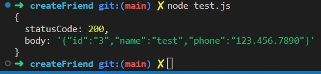
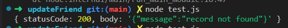
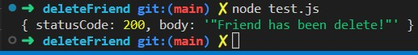
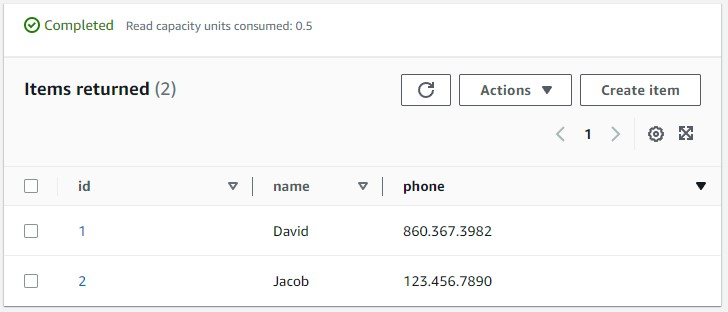

# Documentation

## [Production Link](https://yyk37109b4.execute-api.us-west-2.amazonaws.com/prod)

## UML

</img>

## Routes

- GET /friends/
    - Requires nothing
    - <code>Returns all friends</code>
        </img>
        </img>

- POST /friends/:id 
    - Requires id, name & number
    - <code>Creates a specific friend</code>
        </img>
        </img>

- PUT /friends/:id
    - Requires id
    -  <code>Updates & returns a specific friend</code>
        </img>

- DELETE /friends/:id
    - Requires id
    - <code>Deletes a specific friend</code>
        </img>
        </img>

